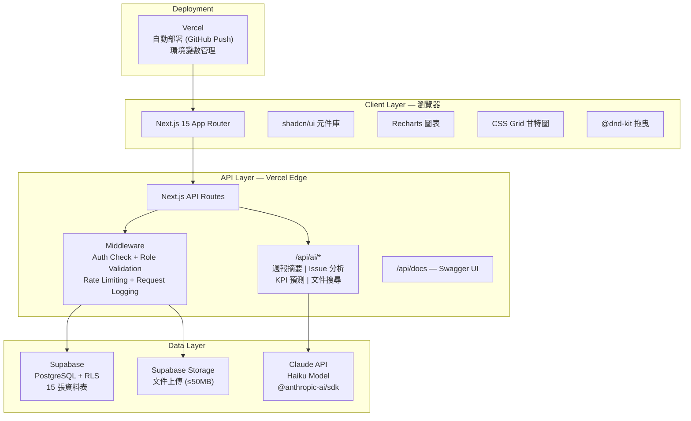

# Design: 富昇物流 × 企業顧問專案管理系統

## 系統架構總覽

### 三層架構



### 請求流程
```
瀏覽器 → Vercel Edge → Next.js Middleware (auth check)
  → API Route (role validation + logAction)
    → Supabase (CRUD + RLS)
    → Claude API (AI 功能, server-side only)
  → Response → 瀏覽器
```

---

## 技術棧決策

| 層級 | 技術 | 版本 | 選型理由 |
|------|------|------|----------|
| 框架 | Next.js App Router | 15.x | 全端統一、RSC、Vercel 原生部署 |
| 語言 | TypeScript | 5.x | Strict mode，型別安全 |
| 樣式 | Tailwind CSS | 3.x | 開發速度快、響應式內建 |
| 元件 | shadcn/ui | latest | 高品質、可客製、無 vendor lock-in |
| 資料庫 | Supabase (PostgreSQL) | — | 免費額度夠三個月、RLS 原生支援、Storage 內建 |
| AI | Claude API (@anthropic-ai/sdk) | latest | Haiku 低成本、速度快、中文能力強 |
| 部署 | Vercel | 免費方案 | GitHub push 自動部署、Edge Functions |
| 圖表 | Recharts | 2.x | React 原生、折線圖/圓餅圖 |
| 甘特圖 | 自製 CSS Grid | — | 避免重型依賴、完全可控 |
| 拖曳 | @dnd-kit/core | 6.x | 輕量、React 原生、無障礙支援 |
| PDF 匯出 | html2pdf.js | 0.10.x | 輕量、前端直出 |
| CSV 匯出 | PapaParse | 5.x | 標準 CSV 處理 |
| API 文件 | swagger-ui-react | 5.x | 互動式 API 文件 |
| 圖表渲染 | Mermaid.js | 10.x | 架構圖、ERD、流程圖 |
| 表單驗證 | react-hook-form + zod | — | 高效能表單 + schema 驗證 |

---

## 資料庫設計

### ERD（Entity Relationship Diagram）

```mermaid
erDiagram
    user_profiles {
        uuid id PK
        text email UK
        text display_name
        text role "consultant|manager|reviewer"
        text avatar_url
        timestamptz created_at
    }

    project_settings {
        uuid id PK
        text project_name
        text client_name
        date start_date
        date end_date
        text description
        text weekly_summary
        timestamptz updated_at
    }

    milestones {
        uuid id PK
        text name
        text assignee
        date planned_date
        date actual_date
        text status "on_track|delayed|completed"
        int order
        uuid created_by FK
        timestamptz created_at
        timestamptz updated_at
    }

    weekly_reports {
        uuid id PK
        int week_number
        int year
        date period_start
        date period_end
        text accomplishments
        text next_plans
        text difficulties
        text help_needed
        boolean is_ai_generated
        uuid created_by FK
        timestamptz created_at
        timestamptz updated_at
    }

    report_comments {
        uuid id PK
        uuid report_id FK
        text content
        uuid author_id FK
        text author_role
        timestamptz created_at
    }

    issues {
        uuid id PK
        text title
        text description
        text priority "high|medium|low"
        text assignee
        date due_date
        text status "todo|in_progress|done"
        int column_order
        uuid created_by FK
        timestamptz created_at
        timestamptz updated_at
    }

    issue_comments {
        uuid id PK
        uuid issue_id FK
        text content
        uuid author_id FK
        text author_role
        timestamptz created_at
    }

    documents {
        uuid id PK
        text filename
        text original_name
        text category "diagnosis|improvement|training|presentation|final"
        int version
        bigint file_size
        text file_path
        text content_summary
        uuid uploaded_by FK
        timestamptz created_at
    }

    document_versions {
        uuid id PK
        uuid document_id FK
        int version
        text file_path
        bigint file_size
        uuid uploaded_by FK
        timestamptz created_at
    }

    kpi_definitions {
        uuid id PK
        text name
        text unit
        decimal target_value
        decimal baseline_value
        text description
        int display_order
        uuid created_by FK
        timestamptz created_at
    }

    kpi_records {
        uuid id PK
        uuid kpi_id FK
        int month
        int year
        decimal actual_value
        decimal achievement_rate
        timestamptz created_at
        timestamptz updated_at
    }

    uat_records {
        uuid id PK
        text test_item
        text tester
        text result "pass|fail|pending"
        text notes
        date test_date
        timestamptz created_at
    }

    system_logs {
        uuid id PK
        timestamptz timestamp
        uuid user_id
        text user_role
        text action "CREATE|UPDATE|DELETE|LOGIN|LOGOUT|EXPORT|AI_GENERATE"
        text module
        uuid record_id
        jsonb old_value
        jsonb new_value
        inet ip_address
        text user_agent
    }

    approval_records {
        uuid id PK
        text module
        uuid record_id
        uuid reviewer_id FK
        text comment
        text status "approved|rejected"
        timestamptz created_at
    }

    ai_usage_logs {
        uuid id PK
        uuid user_id FK
        text feature "weekly_summary|issue_analysis|kpi_forecast|document_search"
        int input_tokens
        int output_tokens
        text model
        decimal cost_usd
        timestamptz created_at
    }

    user_profiles ||--o{ milestones : "created_by"
    user_profiles ||--o{ weekly_reports : "created_by"
    user_profiles ||--o{ report_comments : "author_id"
    user_profiles ||--o{ issues : "created_by"
    user_profiles ||--o{ issue_comments : "author_id"
    user_profiles ||--o{ documents : "uploaded_by"
    user_profiles ||--o{ kpi_definitions : "created_by"
    user_profiles ||--o{ approval_records : "reviewer_id"
    user_profiles ||--o{ ai_usage_logs : "user_id"
    weekly_reports ||--o{ report_comments : "report_id"
    issues ||--o{ issue_comments : "issue_id"
    documents ||--o{ document_versions : "document_id"
    kpi_definitions ||--o{ kpi_records : "kpi_id"
```



### 資料表清單（15 張）

| # | 資料表 | 用途 | 筆數預估 |
|---|--------|------|----------|
| 1 | user_profiles | 使用者資料 | 3 |
| 2 | project_settings | 專案設定 | 1 |
| 3 | milestones | 里程碑 | ~20 |
| 4 | weekly_reports | 週報 | 12 |
| 5 | report_comments | 週報留言 | ~50 |
| 6 | issues | 問題追蹤 | ~50 |
| 7 | issue_comments | Issue 留言 | ~100 |
| 8 | documents | 文件管理 | ~30 |
| 9 | document_versions | 文件版本 | ~50 |
| 10 | kpi_definitions | KPI 定義 | ~6 |
| 11 | kpi_records | KPI 記錄 | ~72 |
| 12 | uat_records | UAT 紀錄 | ~50 |
| 13 | system_logs | 系統日誌 | ~1000 |
| 14 | approval_records | 審核紀錄 | ~30 |
| 15 | ai_usage_logs | AI 使用紀錄 | ~300 |

---

## 安全設計

### 認證與授權
- Supabase Auth（Email + Password）
- Cookie-based session（30 天過期）
- Next.js Middleware 路由保護：未登入 → `/login`
- 每個 API route 驗證 session + 角色

### Row Level Security (RLS)
- 所有資料表啟用 RLS
- 通用 Policy：
  - SELECT：所有已認證用戶
  - INSERT/UPDATE/DELETE：僅 consultant 角色
- 特殊 Policy：
  - report_comments / issue_comments：三角色皆可 INSERT
  - approval_records：僅 reviewer 可 INSERT
  - system_logs：僅 INSERT，無 UPDATE/DELETE（append-only）

### 檔案安全
- 上傳副檔名白名單：`.pdf`, `.docx`, `.xlsx`, `.pptx`
- 大小限制：50MB
- Supabase Storage 使用私有 bucket

### API 安全
- Claude API Key 僅存於 Vercel 環境變數
- 所有 AI 呼叫走 server-side API routes
- Rate limit：每功能每分鐘 5 次
- 所有操作寫入 system_logs

---

## UI 設計規範

### 色彩系統
| 用途 | 色碼 | 說明 |
|------|------|------|
| 主色 | `#1e3a5f` | 深藍，側邊欄背景、標題 |
| 輔色 | `#3b82f6` | 靛藍，按鈕、連結、強調 |
| 成功 | `#10b981` | 綠，完成狀態、on_track |
| 警告 | `#f59e0b` | 黃，即將到期、medium 優先級 |
| 危險 | `#ef4444` | 紅，逾期、high 優先級、delayed |
| AI | `#8b5cf6` | 紫，AI 功能按鈕、AI 生成標記 |
| 背景 | `#f8fafc` | 淺灰，頁面背景 |
| 卡片 | `#ffffff` | 白，卡片背景 |

### 佈局
- 側邊欄：固定導航，寬度 256px，手機折疊為 64px（僅圖示）
- 頂部列：專案名稱 + 登入者角色 + 登出按鈕
- 內容區：最大寬度 1280px，置中，padding 24px
- 響應式斷點：
  - Desktop：≥1024px（完整佈局）
  - Tablet：768~1023px（側邊欄折疊）
  - Mobile：<768px（側邊欄隱藏，漢堡選單）

### 元件規範
- 所有卡片使用 shadcn/ui `Card`
- 表單使用 react-hook-form + zod validation
- 按鈕使用 shadcn/ui `Button`（variant: default/outline/ghost/destructive）
- Dialog 使用 shadcn/ui `Dialog`
- Loading 使用 shadcn/ui `Skeleton`
- 字型：Noto Sans TC（Google Fonts）
- AI 相關元素統一紫色邊框 + ✨ 標記

---

## 目錄結構

```
fusheng-platform/
├── app/
│   ├── layout.tsx                    # Root layout + AuthProvider + Sidebar
│   ├── page.tsx                      # Redirect → /dashboard
│   ├── globals.css                   # Tailwind imports + custom styles
│   ├── login/
│   │   └── page.tsx                  # 登入頁
│   ├── dashboard/
│   │   └── page.tsx                  # 專案總覽儀表板
│   ├── milestones/
│   │   └── page.tsx                  # 時程里程碑管理
│   ├── weekly-reports/
│   │   ├── page.tsx                  # 週報列表
│   │   └── [id]/
│   │       └── page.tsx              # 單篇週報詳情
│   ├── issues/
│   │   └── page.tsx                  # Kanban 看板
│   ├── documents/
│   │   └── page.tsx                  # 文件管理
│   ├── kpi/
│   │   └── page.tsx                  # KPI 儀表板
│   ├── docs-center/
│   │   ├── layout.tsx                # 文件中心共用 layout
│   │   ├── architecture/
│   │   │   └── page.tsx
│   │   ├── changelog/
│   │   │   └── page.tsx
│   │   ├── test-records/
│   │   │   └── page.tsx
│   │   ├── logs/
│   │   │   └── page.tsx
│   │   └── user-manual/
│   │       └── page.tsx
│   └── api/
│       ├── auth/
│       │   └── callback/
│       │       └── route.ts          # Supabase Auth callback
│       ├── milestones/
│       │   └── route.ts
│       ├── weekly-reports/
│       │   └── route.ts
│       ├── issues/
│       │   └── route.ts
│       ├── documents/
│       │   ├── route.ts              # CRUD
│       │   └── upload/
│       │       └── route.ts          # File upload
│       ├── kpi/
│       │   └── route.ts
│       ├── logs/
│       │   └── route.ts
│       ├── ai/
│       │   ├── weekly-summary/
│       │   │   └── route.ts
│       │   ├── issue-analysis/
│       │   │   └── route.ts
│       │   ├── kpi-forecast/
│       │   │   └── route.ts
│       │   └── document-search/
│       │       └── route.ts
│       └── docs/
│           └── route.ts              # Swagger UI
├── components/
│   ├── ui/                           # shadcn/ui 元件
│   │   ├── button.tsx
│   │   ├── card.tsx
│   │   ├── dialog.tsx
│   │   ├── input.tsx
│   │   ├── select.tsx
│   │   ├── skeleton.tsx
│   │   ├── table.tsx
│   │   ├── textarea.tsx
│   │   └── ...
│   ├── layout/
│   │   ├── sidebar.tsx               # 側邊欄導航
│   │   ├── header.tsx                # 頂部列
│   │   └── auth-provider.tsx         # Auth context provider
│   ├── dashboard/
│   │   ├── project-info-card.tsx     # 專案基本資訊
│   │   ├── progress-pie-chart.tsx    # 模組完成圓餅圖
│   │   ├── milestone-alerts.tsx      # 逾期警示
│   │   └── weekly-summary-card.tsx   # 本週摘要（含 AI 按鈕）
│   ├── milestones/
│   │   ├── gantt-chart.tsx           # CSS Grid 甘特圖
│   │   ├── milestone-form.tsx        # 新增/編輯表單
│   │   └── milestone-table.tsx       # 表格視圖
│   ├── weekly-reports/
│   │   ├── report-form.tsx           # 週報表單（含 AI 草稿）
│   │   ├── report-timeline.tsx       # 歷史時間軸
│   │   └── report-comments.tsx       # 留言區
│   ├── issues/
│   │   ├── kanban-board.tsx          # Kanban 看板
│   │   ├── issue-card.tsx            # 卡片元件
│   │   ├── issue-form.tsx            # 新增/編輯表單
│   │   └── issue-filters.tsx         # 篩選器
│   ├── documents/
│   │   ├── upload-zone.tsx           # 拖曳上傳區
│   │   ├── document-list.tsx         # 文件列表
│   │   └── pdf-viewer.tsx            # PDF 預覽
│   ├── kpi/
│   │   ├── kpi-card.tsx              # KPI 摘要卡片
│   │   ├── kpi-line-chart.tsx        # 折線圖（含 AI 預測）
│   │   └── kpi-form.tsx              # 指標/數值表單
│   └── ai/
│       ├── ai-button.tsx             # 共用 AI 觸發按鈕
│       ├── ai-result-panel.tsx       # AI 結果面板
│       └── ai-loading.tsx            # AI 生成中動畫
├── lib/
│   ├── supabase/
│   │   ├── client.ts                 # Browser client (createBrowserClient)
│   │   ├── server.ts                 # Server client (createServerClient)
│   │   └── middleware.ts             # Auth middleware
│   ├── ai/
│   │   ├── client.ts                 # Anthropic SDK 初始化
│   │   ├── prompts.ts                # 四項功能的 prompt 模板
│   │   └── rate-limit.ts             # Rate limiter
│   ├── log-action.ts                 # logAction() utility
│   ├── auth.ts                       # Auth helper functions
│   ├── pdf-export.ts                 # html2pdf.js wrapper
│   ├── csv-export.ts                 # PapaParse wrapper
│   └── utils.ts                      # cn() + 共用工具
├── types/
│   ├── database.ts                   # Supabase generated types
│   ├── ai.ts                         # AI 請求/回應型別
│   └── index.ts                      # 共用型別 export
├── __tests__/
│   ├── api/                          # API route 單元測試
│   ├── components/                   # 元件測試
│   └── e2e/                          # Playwright E2E 測試
├── docs/
│   ├── ARCHITECTURE.md
│   ├── CHANGELOG.md
│   ├── USER_MANUAL.md
│   └── adr/
│       ├── ADR-001-tech-stack.md
│       └── ADR-002-database-design.md
├── supabase/
│   └── migrations/                   # SQL migration files
│       └── 001_initial_schema.sql
├── public/
│   └── logo.svg                      # 專案 logo
├── CLAUDE.md                         # SDD 開發規範
├── package.json
├── tsconfig.json
├── tailwind.config.ts
├── next.config.ts
├── middleware.ts                     # Next.js root middleware
├── .env.local                        # 環境變數（不入 git）
├── .env.example                      # 環境變數範例
└── .gitignore
```

---

## 依賴套件清單

### Production
```json
{
  "next": "^15.0.0",
  "@supabase/supabase-js": "^2.45.0",
  "@supabase/ssr": "^0.5.0",
  "@anthropic-ai/sdk": "^0.30.0",
  "recharts": "^2.12.0",
  "@dnd-kit/core": "^6.1.0",
  "@dnd-kit/sortable": "^8.0.0",
  "@dnd-kit/utilities": "^3.2.0",
  "html2pdf.js": "^0.10.1",
  "papaparse": "^5.4.0",
  "mermaid": "^10.9.0",
  "swagger-ui-react": "^5.17.0",
  "react-hook-form": "^7.53.0",
  "zod": "^3.23.0",
  "@hookform/resolvers": "^3.9.0",
  "class-variance-authority": "^0.7.0",
  "clsx": "^2.1.0",
  "tailwind-merge": "^2.5.0",
  "lucide-react": "^0.441.0",
  "date-fns": "^3.6.0"
}
```

### Dev
```json
{
  "typescript": "^5.6.0",
  "@types/node": "^22.0.0",
  "@types/react": "^18.3.0",
  "@types/papaparse": "^5.3.0",
  "tailwindcss": "^3.4.0",
  "postcss": "^8.4.0",
  "autoprefixer": "^10.4.0",
  "jest": "^29.7.0",
  "@testing-library/react": "^16.0.0",
  "@testing-library/jest-dom": "^6.5.0",
  "@playwright/test": "^1.47.0",
  "eslint": "^8.57.0",
  "eslint-config-next": "^15.0.0"
}
```

---

## 環境變數

```env
# Supabase
NEXT_PUBLIC_SUPABASE_URL=https://xxx.supabase.co
NEXT_PUBLIC_SUPABASE_ANON_KEY=eyJ...
SUPABASE_SERVICE_ROLE_KEY=eyJ...

# Anthropic (Claude API)
ANTHROPIC_API_KEY=sk-ant-...

# App
NEXT_PUBLIC_APP_URL=https://fusheng-consultant.vercel.app
```
